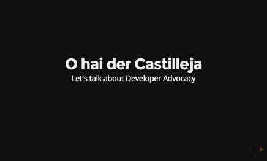

# Developer Advocacy
## Where distracted engineers go to hang out

Slides from a 15-20 minute discussion about Developer Advocacy and how I got there.

Slides live on [mimming.com](http://mimming.com/presos/c-steam-on-dev-advocacy/)

## Presented at
- [Castilleja](http://www.castilleja.org/) C-STEAM on 11 Feb 2015

## About the deck

Forked from the wonderful [reveal.js](https://github.com/hakimel/reveal.js)

Awesome cat photos by [morozmoroz on Flickr](https://www.flickr.com/photos/morozmoroz/)

## License

[Apache 2.0](http://www.apache.org/licenses/LICENSE-2.0)

Copyright (C) 2015 Mimming Codes